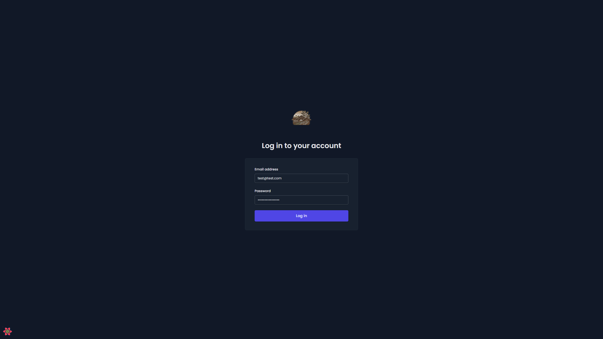
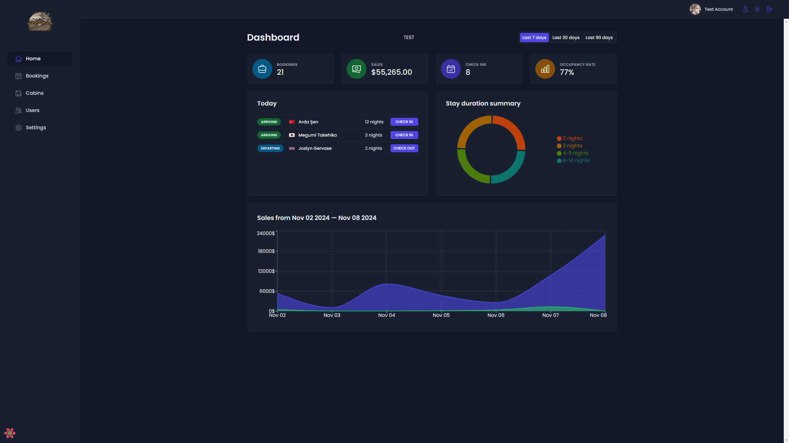
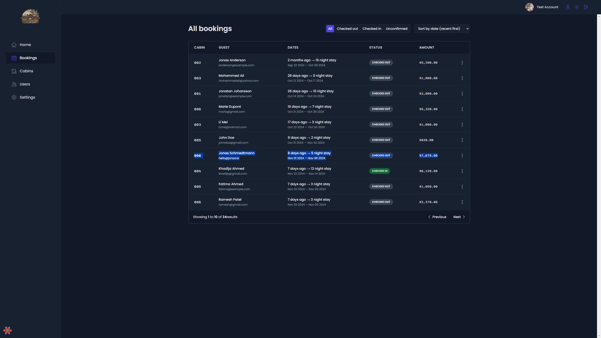
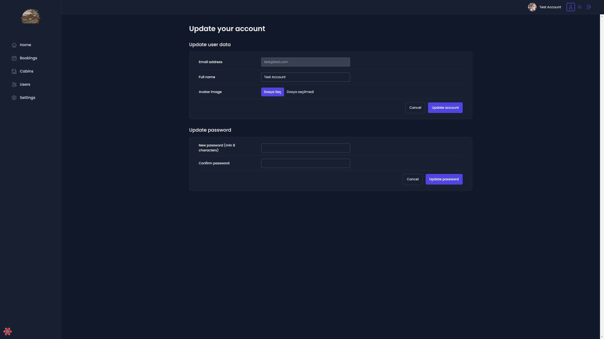
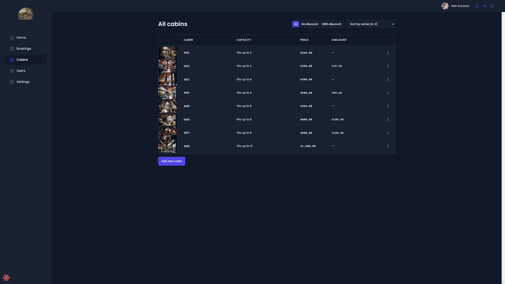
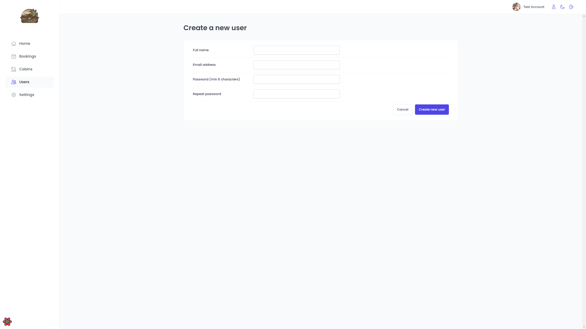

# Hotel Management Application

This project provides a comprehensive management system for Hotels, which can also be utilized by a wide range of businesses that require booking systems and similar functionalities.

It is a modern web application built using React and various powerful libraries such as React Query, React Router, Supabase(for back-end), Styled Components etc.

Log in with the default test account to check all the features.

<a href = "https://hotel-management-app-ardsens-projects.vercel.app/">LIVE</a>

  
  
  
  
  
  

